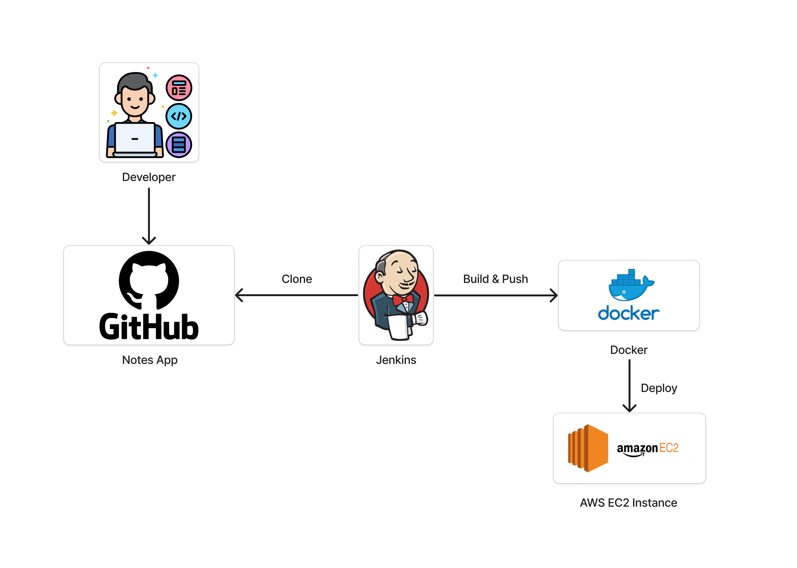

<div align="center">
  <h1>Notes App Project</h1>
</div>

Final project mata kuliah Pengembangan Sistem dan Operasi (PSO) atau DevOps Sistem Informasi ITS 2024.


## Problem Definition

In the digital age, people often need to take notes for various purposes such as meetings, lectures, personal thoughts, and to-do lists. Traditional methods of note-taking on paper can be cumbersome, disorganized, and easily lost. Many existing digital note-taking solutions are either too complex, lacking in essential features, or not user-friendly. There is a need for a simple, efficient, and user-friendly notes app that can help users organize their thoughts and tasks effectively.

## Solution Overview

A notes app project website serves as a comprehensive platform to create, manage, and access notes efficiently. By utilizing user-centered features and design, this notes app enhances user productivity.By using the pipeline, it can make it easier for users to access website.



**Tools**
- GitHub: Version Control Setup
- Jenkins: CI/CD Tools
- Docker: Containerization
- React.js & Node.js: Frontend & Development Server
- Terraform: Infrastructure-as-Code (IaC)
- Python & Django: Framework & Backend

## Step-by-Step
### Part 1. Create new instance in AWS portal
Open AWS Portal and create new instance. Choose the AMI for ubuntu and instance type is t2.micro (free tier). In the section of Key pair login, you have to create new key pair. After new key pair created, check the list to Allow HTTP and Allow HTTPS. After all, click on Launch Instance and connect to the EC2 instance.

### Part 2. Install Docker
Install the `docker` package with `apt` as follows:
```bash
sudo apt-get install docker-ce docker-ce-cli containerd.io docker-buildx-plugin docker-compose-plugin
```

### Part 3. Install jdk in instance
To install the `jdk` in instance you can use the command as follows:
```bash
sudo apt install openjdk-17-jre
```

### Part 4. Install Jenkins
Install `jenkins` using the command as follows:
```bash
sudo yum install jenkins
sudo systemctl enable jenkins
sudo systemctl start jenkins
sudo systemctl status jenkins
```

### Part 5. Docker compose
Do `docker compose` using command as follows:
```bash
sudo apt-get install docker-compose
```

### Part 6. Install Terraform
Install the terraform IaC using command as follows:
```bash
sudo apt-get update 
sudo apt-get install -y gnupg software-properties-common
```

### Part 7. Edit inbound role in instance
To edit inbound role, you can click your instance that will be show a details of the instance. Then, you can click security tab and open the security groups. And you can edit inbound role and add new port 8080 and 8000.
- Port 8080: For Jenkins
- Port 8000: For the machine


### Part 8. Get Administrator Password
To unlock Jenkins, an administrator password is required which can be used with the following command:
```bash
cat /var/lib/jenkins/secrets/initialAdminPassord
```

### Part 9. Get into Jenkins
1. To log into jenkins page, use IP `ip-address:8080`.
2. Create your account
3. Install the docker plugin in Manage Jenkins > Plugins > Available Plugins > search Docker Pipeline.

### Part 10. Configure Jenkins
1. Create a CI/CD pipeline from Jenkins Dashboard and click on `New Item`
2. Enter an item name, choose `pipeline`, and click `OK`.
3. Configure pipeline in Dashboard > `your-name-item` > configuration > general
4. Click `GitHub Project` and copy your GitHub project URL.
5. Check `GitHub hook trigger for GITScm polling` and save.

### Part 11. Create Credentials for Jenkins Pipeline
1. Create credentials in Dashboard > Manage Jenkins > Credentials > System > Gloal Credentials.
2. Choose scope `Global`.
3. Insert the username and password with the value as you like.
4. Insert the ID `dockerHub`.
5. Create new credentials with scope `SSH`.
6. Insert the ID `ssh-key`.
7. Input the key that you got from create key pair in instance.


### Part 12. Create GitHub Webhook
1. Go to your GitHub repository.
2. Click settings > Webhooks.
3. On the page Webhooks displayed, input the jenkins public IP address.
4. Click `send me everything`.
5. Click `Add webhook`.

### Part 13. Run your Jenkins Pipeline
Run your pipeline using the jenkins that was opened on your instance.

### Finish! Now, your Notes App Project is accessible.


<!-- # Getting Started with Create React App

This project was bootstrapped with [Create React App](https://github.com/facebook/create-react-app).

## Available Scripts

In the project directory, you can run:

### `npm start`

Runs the app in the development mode.\
Open [http://localhost:3000](http://localhost:3000) to view it in your browser.

The page will reload when you make changes.\
You may also see any lint errors in the console.

### `npm test`

Launches the test runner in the interactive watch mode.\
See the section about [running tests](https://facebook.github.io/create-react-app/docs/running-tests) for more information.

### `npm run build`

Builds the app for production to the `build` folder.\
It correctly bundles React in production mode and optimizes the build for the best performance.

The build is minified and the filenames include the hashes.\
Your app is ready to be deployed!

See the section about [deployment](https://facebook.github.io/create-react-app/docs/deployment) for more information.

### `npm run eject`

**Note: this is a one-way operation. Once you `eject`, you can't go back!**

If you aren't satisfied with the build tool and configuration choices, you can `eject` at any time. This command will remove the single build dependency from your project.

Instead, it will copy all the configuration files and the transitive dependencies (webpack, Babel, ESLint, etc) right into your project so you have full control over them. All of the commands except `eject` will still work, but they will point to the copied scripts so you can tweak them. At this point you're on your own.

You don't have to ever use `eject`. The curated feature set is suitable for small and middle deployments, and you shouldn't feel obligated to use this feature. However we understand that this tool wouldn't be useful if you couldn't customize it when you are ready for it.

## Learn More

You can learn more in the [Create React App documentation](https://facebook.github.io/create-react-app/docs/getting-started).

To learn React, check out the [React documentation](https://reactjs.org/).

### Code Splitting

This section has moved here: [https://facebook.github.io/create-react-app/docs/code-splitting](https://facebook.github.io/create-react-app/docs/code-splitting)

### Analyzing the Bundle Size

This section has moved here: [https://facebook.github.io/create-react-app/docs/analyzing-the-bundle-size](https://facebook.github.io/create-react-app/docs/analyzing-the-bundle-size)

### Making a Progressive Web App

This section has moved here: [https://facebook.github.io/create-react-app/docs/making-a-progressive-web-app](https://facebook.github.io/create-react-app/docs/making-a-progressive-web-app)

### Advanced Configuration

This section has moved here: [https://facebook.github.io/create-react-app/docs/advanced-configuration](https://facebook.github.io/create-react-app/docs/advanced-configuration)

### Deployment

This section has moved here: [https://facebook.github.io/create-react-app/docs/deployment](https://facebook.github.io/create-react-app/docs/deployment)

### `npm run build` fails to minify

This section has moved here: [https://facebook.github.io/create-react-app/docs/troubleshooting#npm-run-build-fails-to-minify](https://facebook.github.io/create-react-app/docs/troubleshooting#npm-run-build-fails-to-minify) -->
